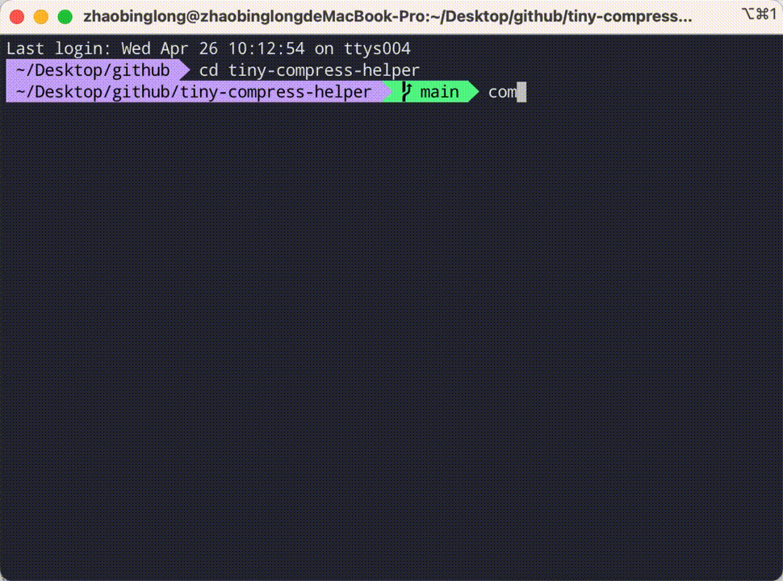

<div >
	
</div>

## tiny-compress-helper
🛠️ a command line tool for you to compress pictures based on tinypng.com

## Shots
<div align="center">
	
</div>

## Install

```sh
npm install tiny-compress-helper
```

## Usage

```js
compress ./xx/xx
```

## License

[MIT](https://opensource.org/licenses/MIT)
